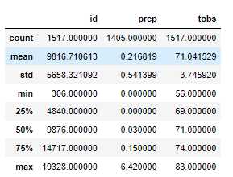

# surfs_up
The purpose of this analysis was to give our client temperature trends for the months of June and December in anticipation of opening a surf shop.

## Analysis of June Data
Using Python with an extraction from a Sqlite database, the analysis shows that for the month of June, the average temperature is 74.9 degrees with a standard deviation of 3.3 degrees

## Analysis of December Data
December data showed and average temperature of 71.0 degrees as well with a standard deviation of only 3.7 degrees.

## Variances between the months
There are key differences betweent the weather in the two months:

1 - June is about 3 degree warmer on average

2 - There is a slightly greater variance in temperatue in December

3 - Minimum temperatures in December can drop into the 50's.

### Conclusion
While there are some variances in temperature in the two months, there seem to be sufficient weather to open a surf shop during both months.
