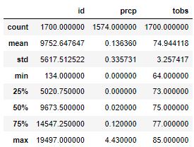

# surfs_up
The purpose of this analysis was to give our client temperature trends for the months of June and December in anticipation of opening a surf shop.

## Analysis of June Data
Using Python with an extraction from a Sqlite database, the analysis shows that for the month of June, the average temperature is 71 degrees 

